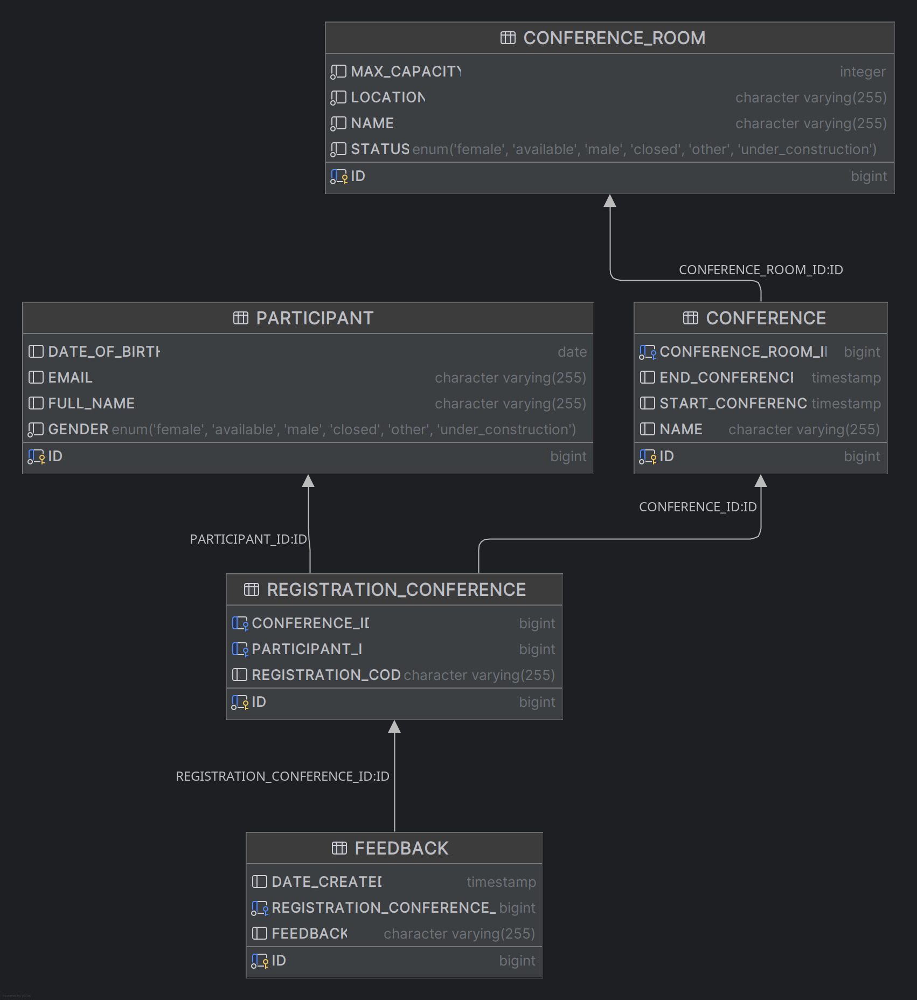

# conference-platform

This application provides a small conference management system, that will contain at least 2 modules:
Back Office Gateway and Conference Gateway.
-----

## Requirements:

- Java 21
- SpringBoot 3
- Gradle 8.4
- H2
- Docker 25
- JUnit
- Currently, only tested on Fedora 39 and IntelliJ IDEA

## Running using Docker Compose:

```bash
cd conference-platform
docker-compose -f docker-compose.yml up
```

## How to run locally:

```bash
cd conference-platform
gradle clean
gradle bootRun
```

## Run with Docker:

```bash
cd conference-platform
gradle clean build
docker build --no-cache --build-arg JAR_FILE=build/libs/\*.jar -t renvl/conference-platform .
docker run -p 8080:8080 -t renvl/conference-platform
```

## Database Design



Available Customers ID

| conference_room\_name |
|:----------------------|
| room one              |
| room two              |
| room three            |
| room four             |

## API:

#### http[]()://localhost:8080/api

### Registration

#### /api/registration

* `POST` : Create Registration

    ```bash
    curl --request POST \
      --url http://localhost:8080/api/registration \
      --header 'Content-Type: application/json' \
      --data '{
        "fullName": "string",
        "gender": "MALE",
        "email": "string",
        "dateOfBirth": "yyyy-MM-dd",
        "idConference": 0
      }'
    ```

#### /api/registration/{code}

* `DELETE` : Cancel Registration

### Conference Room

#### /api/conference-room

* `PUT` : Update Conference Room

    ```bash
    curl --request PUT \
    --url http://localhost:8080/api/conference-room \
    --header 'Content-Type: application/json' \
    --data '{
      "idConferenceRoom": 0,
      "status": "UNDER_CONSTRUCTION",
      "maxCapacity": 0
    }'
    ```

#### /api/conference-room

* `POST` : Create Conference Room

    ```bash
    curl --request POST \
      --url http://localhost:8080/api/conference-room \
      --header 'Content-Type: application/json' \
      --data '{
        "conferenceRooms": [
          {
            "name": "string",
            "status": "UNDER_CONSTRUCTION",
            "location": "string",
            "maxCapacity": 0
          }
        ]
      }'
    ```

## Swagger-ui

http://localhost:8080/swagger-ui/index.html Swagger-UI formatted documentation.

NB!, in the API documentation pages, documentations for POST and GET requests for the conference-platform can be seen.
Moreover, in Swagger UI for example, making a query is quite easy with example formats.

## Parametrization:

To connect Postgres and RabbitMQ use the properties according
to [application.properties](src/main/resources/application.properties)

## License

conference-platform is distributed under the terms of the
[MIT License](https://choosealicense.com/licenses/mit).
